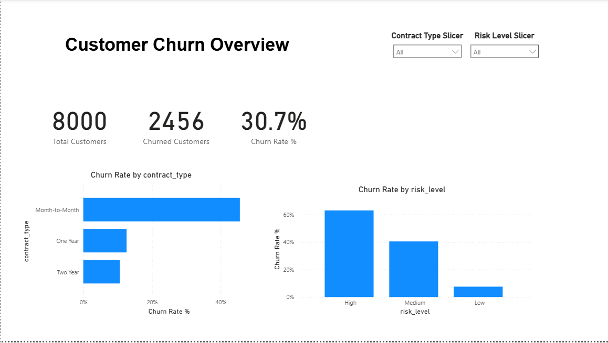
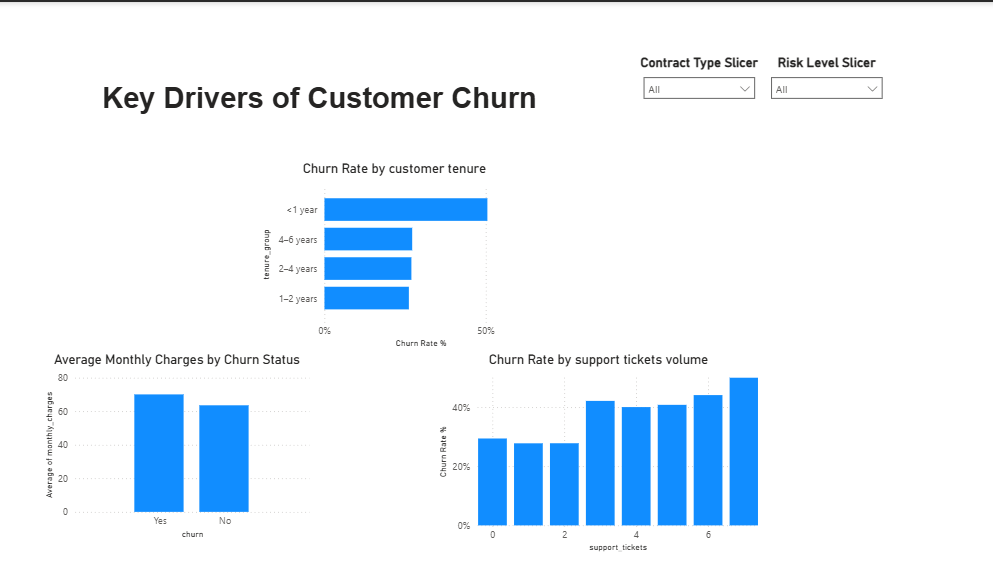
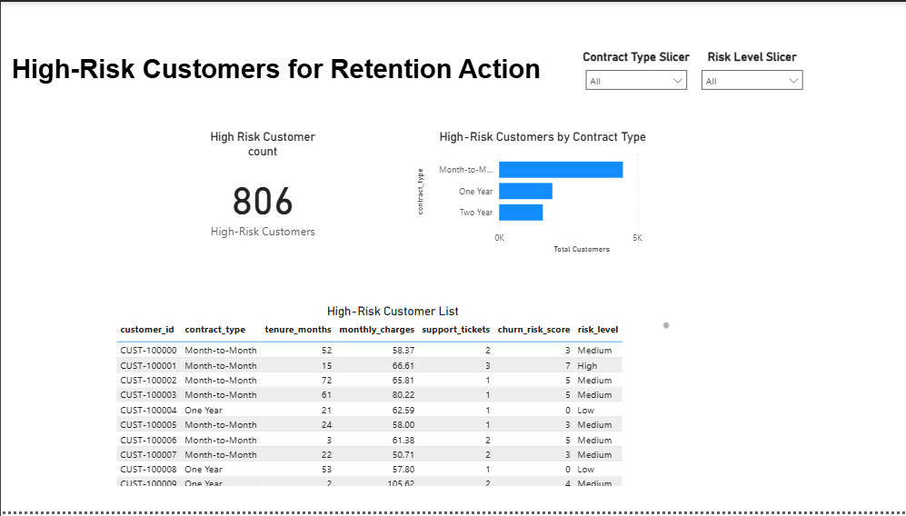

# 🔁 Customer Churn Analysis

## Project Overview

This project analyzes customer churn data to identify the key factors driving customer attrition in a subscription-based business. The analysis focuses on understanding customer behaviour, identifying high-risk segments, and providing actionable recommendations to improve customer retention.

Customer churn has a direct impact on revenue and growth. By understanding *why* customers leave, businesses can take targeted actions to reduce churn and improve long-term profitability.

---

## Business Objective

The objective of this analysis is to:

* Measure the overall customer churn rate
* Identify churn patterns across contract types, tenure, and pricing
* Understand the relationship between customer support issues and churn
* Segment customers based on churn risk
* Provide data-driven recommendations to improve retention

---

## Dataset

* **Source:** Synthetic customer subscription dataset (created for analytical demonstration)
* **Size:** ~8,000 customer records
* **Granularity:** One row per customer

### Key Fields

* `customer_id` – Unique customer identifier
* `tenure_months` – Length of time the customer has been with the company
* `contract_type` – Month-to-Month, One Year, or Two Year contract
* `monthly_charges` – Monthly subscription cost
* `support_tickets` – Number of customer support interactions
* `payment_method` – Customer payment method
* `churn` – Whether the customer churned (Yes / No)

---

## Key Questions Explored

* What is the overall churn rate?
* Which contract types have the highest churn?
* How does customer tenure influence churn behaviour?
* Do higher monthly charges correlate with increased churn?
* Are customers with frequent support issues more likely to churn?

---

## Analytical Approach

* Data validation and basic cleaning
* Exploratory Data Analysis (EDA) using Python
* Segmentation of customers by tenure, contract type, and pricing
* Comparison of churn rates across key customer attributes
* Identification of high-risk customer segments

---

## Key Insights (Summary)

* Customers on **month-to-month contracts** exhibit significantly higher churn rates compared to long-term contracts.
* **Short-tenure customers** (less than 12 months) are more likely to churn.
* Higher **monthly charges** are associated with increased churn probability.
* Customers with **multiple support tickets** show elevated churn risk.
* Customers classified as High Risk exhibit significantly higher churn compared to Medium and Low Risk segments.

(Detailed analysis and visualisations are available in the Jupyter notebook.)

---

## Business Recommendations

* Encourage customers to move from month-to-month to longer-term contracts through incentives.
* Improve onboarding and engagement for new customers within their first year.
* Review pricing strategies for high-cost plans to ensure perceived value.
* Proactively engage customers with frequent support issues to resolve pain points before churn occurs.

---

## Skills Demonstrated

* Exploratory data analysis (EDA) using Python
* Customer segmentation and churn analysis
* Business-focused data interpretation
* Translating analytical findings into actionable recommendations

---

## Repository Structure

```
customer-churn-analysis/
├── data/
│   └── customer_churn_data.csv
├── notebooks/
├── sql/
└── README.md
```

The full analysis, code, and visualisations can be found in the `notebooks/` directory.

## Exploratory Data Analysis

The exploratory analysis was conducted in Python using a Jupyter Notebook:

- [Churn EDA Notebook](notebook/churn_eda.ipynb)

The notebook covers churn rate analysis, customer segmentation, and the
development of a rule-based churn risk score.


## Dashboard Preview

### Customer Churn Overview


### Key Drivers of Customer Churn


### High-Risk Customers for Retention Action

